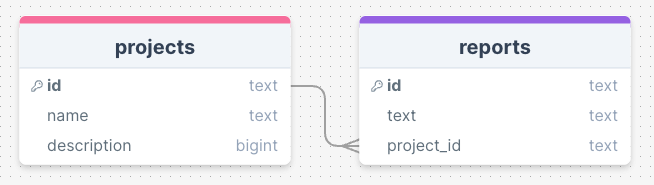

# DPS Backend Coding Challenge

## This repository

This repository contains a very basic web application based on Typescript and Express.js. Main application file is `index.ts`. Node and npm are required.

To start the application run:

```
npm install
npm run dev
```

Once started, the application will be running on `http://localhost:3000`.

## The context

You are working on a new software that should manage data about a company's projects and their reports.
Each project can have one or more reports related to it, but it doesn't have to have any. Use the provided SQLite database as a starting point for your implementation ([db/db.sqlite3](./db/db.sqlite3)).



NOTE: You can use ([db.service.ts](./src/services/db.service.ts)) to handle SQL queries to the database.

## The task

-   Fork this project's code
-   Design and implement REST API for creating, reading, updating, and deleting projects and their reports
-   Create API endpoint that returns all reports where the same word is used at least three times
-   Optionally protect all API routes by a hardcoded auth token "Password123" 😊
-   Push all your code to your public GitHub repository
-   Use small commits, we want to see your progress towards the solution
-   Code clean and follow the best practices

\
After you have finished, please send us the URL to your GitHub repository.
\
Happy coding!
